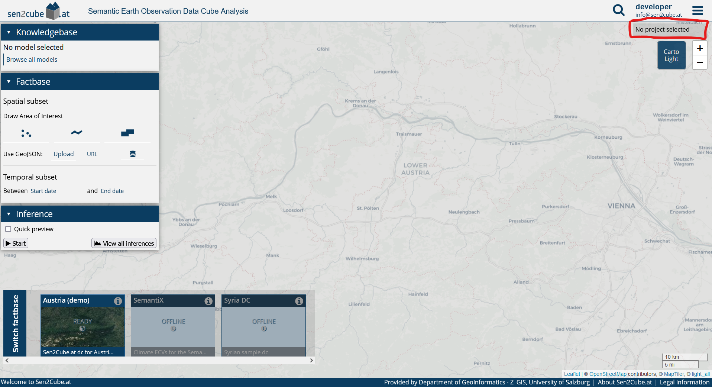
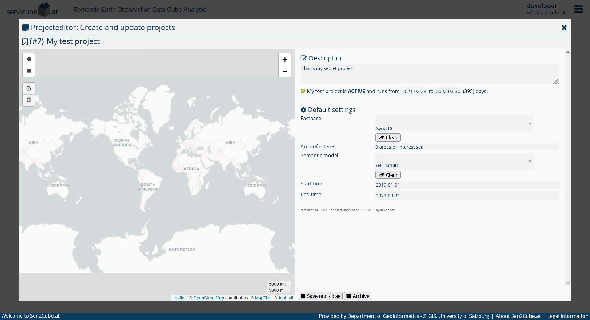
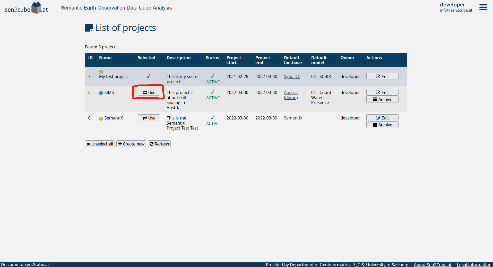
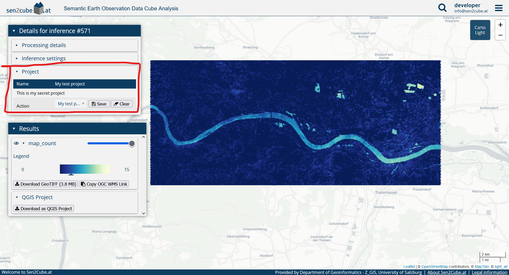
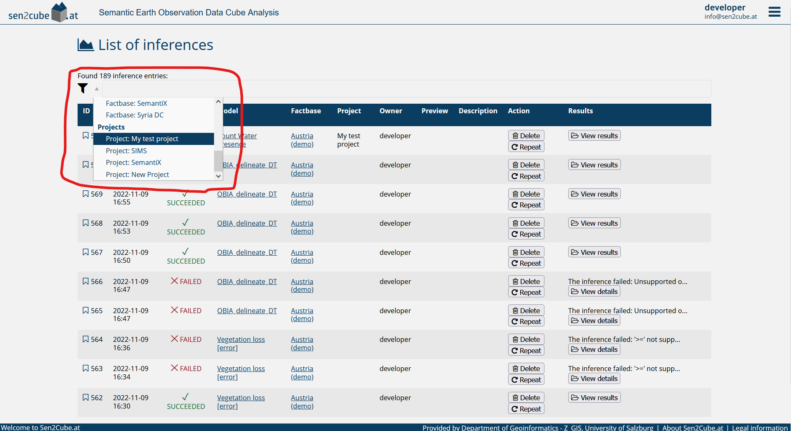

# Advanced usage of the Sen2Cube.at system

## Projects

### Introduction

Projects are a feature to organise inferences and results. Inferences can (optionally) be associated to user-defined projects and therefore logically grouped. Example use-cases could be to group inferences, which are

- created within the context of an existing project
- within a specific region (e.g. a state in Austria)
- of a specific time (e.g., to have different projects for inferences in the years 2020, 2021, 2022)
- part of a processing campaign to be merged later offline
- ...

There are no constraints how to use projects and you are free to use the for any purpose that may be useful.

```{block, type='rmdnote'}
If inferences are executed while a project is activated, the inference results will be automatically associated to the project. This can be changed later.
```

If inferences are associated to a project, they can be filtered in the inference list to get a better overview. If a project has default settings (default factbase, semantic model, AOI, ...), the default settings will be configured automatically if the project is activated. For example, you can create a project for urban green monitoring and set a default AOI (e.g. a city) and semantic model and you have to change only the time interval after activating the project.

### Creating a project

It is always visible in the viewer whether a project is activated or not. This can be checked on the top-right corner of the map viewer. The entry *No projects activated* means that inferences will not be added to a project. By clicking on this button or on the home menu and *projects* it is possible to view all projects and edit them or create new ones.


{width=100%}

By clicking on *create new project* or editing an existing one the *project editor* opens.

{width=100%}

Give your new project a name by typing it in the input field at the top and, optionally a description. YOu can specify the runtime of the project by setting a start date and, optionally, an end date.

The section *Default settings* allow you to specify optional settings that will be set when the project is activated. For example, the area-of-interest, a semantic model, or the factbase for an inferences will be automatically taken from the project after activation.

On the bottom it is possible to save and close the project editor and to archive projects. An archived project can not be activated anymore but executed inferences remain associated.

### Selecting a project

A project can be selected or activated by clicking on the *use* button in the project list


{width=100%}

Completed and existing inferences can be assigned and un-assigned to projects in the result view in the panel on the left side. The *Project* tab allows to view the project to which these inference results belong and to change it by selecting a new project from the dropdown list and clicking on *save* or *clear* to remove a project association.


{width=100%}

### Searching for inferences that belong to a project

The inference list has a standard filter to select inferences that belong to a specific project. Select the inference list by clicking on the main menu and *Inferences*. With the filter icon on the left side of the search bar it is possible to filter for all projects that belong to your account.

{width=100%}

## Factbases
### Metadata information about factbases

Every factbase is provided with a set of metadata that may be useful for the semantic querying process. The factbase metadata can be obtained by clicking on the round (i) symbol of the factbase entries.

{width=100%}

{width=100%}

```{block, type='rmdnote'}
Even if the buttons are visible, most users don't have permission to change the settings and information of the factbases. Trying to change them will result in an error. If you have a request for changes of the settings, please contact info@sen2cube.at
```

### Switching between factbases

The Sen2Cube.at system allows switching between different factbases. This can be done by clicking on the target factbase at the bottom of the screen.

{width=100%}


However, switching a factbase may come with side effects that need to be considered.

```{block, type='rmdnote'}
The semantic enrichment produces similar output (colour names), and therefore a lot of models are transferable between the factbase. This means they can be used in more than one factbase. However, suppose there are sensor-specific elements, such as reflectance values. In that case, the model is implicitly tied to the specific sensor. In this case, the model is not transferable anymore, except the factbase was set up identically.
```

```{block, type='rmdwarning'}
When you change the factbase, your query settings will be lost/reset. The reason is that settings such as the area-of-interest or the time period depend on the selected factbase.
```

## Knowledgebase

### Metadata information about models

Every model is provided with metadata, which can help develop and use a model in a semantic query. The model editor allows switching to the metadata view using the button on the top right.

{width=100%}
{width=100%}

The metadata view allows entering a detailed description of the model with unlimited text length. The layout provides more information about the currently selected **factbase** and can be helpful during the model development phase.

### Marking models as favourite

It is possible to select and mark one or more models that as a favourite. They will be shown first in the knowledgebase. The symbol is the typical bookmark, dark (filled) when the model is selected as favourite and bright (not filled) when they are not. The model editor allows to select and de-select a model as a favourite by clicking on the symbol.

{width=100%}
{width=100%}

```{block, type='rmdnote'}
Marking a model as a favourite affects only the presentation in the knowledgebase; it does not affect the performance etc.
```

## Inferences and semantic queries

### Marking inferences as favourite

Similar to models, it is also possible to mark inferences as a favourite. They will be then sorted so that they appear first in the interfaces. The symbol is the typical bookmark, dark (filled) when the inference is selected as favourite and bright (not filled) when they are not. Inferences can be easily selected and de-selected as a favourite within the list of inferences by clicking on the bookmark symbol.

{width=100%}


### Cloning inference settings

Sometimes it is necessary to re-execute a semantic query with slightly different settings. In these cases, it is not required to draw the area-of-interest etc. again. Instead, it is possible to *clone* the inference settings in a new inference. While the *repeat* button simply re-executes the query, the *clone* button clones the inference settings on the main page.

{width=100%}
```{block, type='rmdwarning'}
When you clone the inference settings, existing settings will be overwritten!
```

